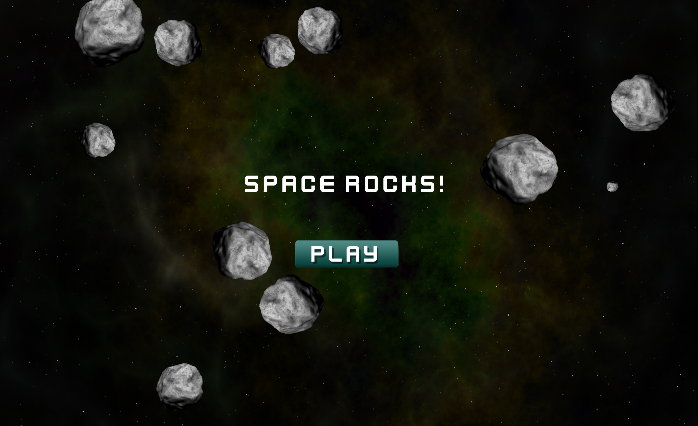
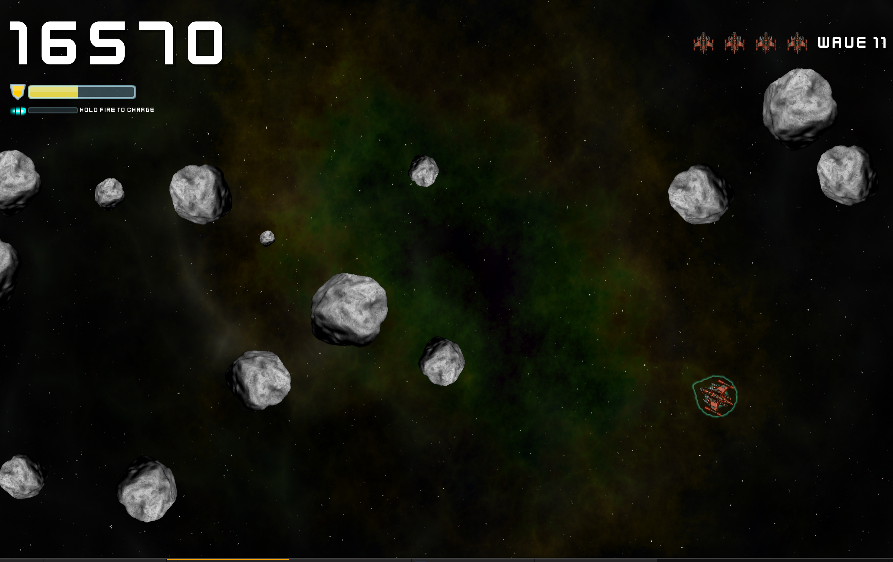

#space rocks
===========
An exciting space adventure where you shoot rocks and conquer challenges. Get ready for hours of fun! 

Audio credits
===========
Audio from [sfxr](https://sfxr.me/).

How to Play
===========
Fly around and shoot asteroids and UFOs. Try not to die.

A new wave starts once all the space rocks are destroyed.
For each new wave +50 shield is earned.

Free ship every 1000 points.

ENTER/Left Click = PLAY  
ESCAPE = Pause  

### Mouse Mode
> Note if you later move joystick or use keys to play, it will turn off mouse mode. To re-enable just move the mouse again.

Aim: `Move mouse`  
Shoot: `Left Click`  
Thrust: `Right Click`  
Slow Down: `Middle Click`  

### Movement
Rotate Left: `Left Arrow`, `A`, `Joystick Left`  
Rotate Right: `Right Arrow`, `D`, `Joystick Right`  
Thrust: `Up Arrow`, `W`, `Joystick Up` - Hold to go fast, tap repeatedly to go slower  
Slow Down: `Down Arrow`, `S`, `Joystick Down`  
Rotate Turbo: `SHIFT`  

### Shield
- Shields recharge slowly over time.  
- Shields recharge faster when not moving or shooting or charging shots.  
- Shields fully replenished every `1000` points.  
- Shields fully replenished when hitting any rock with a level 3 charged laser.  
- Shields recharged `+50` when a new wave starts.  

### Laser
Fire: `Space`, `Joystick Button 1`  
Hold Fire: `Charge laser`  

#### Charged Laser
3 levels of charged shot. Charging costs shield energy. It's a trade-off.  
  
1 - More damage  
2 - Even more damage - and the shot pierces through rocks, and destroys at least 1 generation of rock child spawn - Destroys UFOs in 1 hit.  
3 - Max damage - Destroys entire rock, preventing spawning more rocks, pierces through rocks - Destroys UFOs in 1 hit. ALSO replenishes shields to FULL if hit any rock.  

#### Shields
Automatically replenish over time. Shooting costs shield energy. Charged shots cost more shield energy, with each level more expensive than the previous one.  

I've hosted this on my site here: https://sakthiexe.itch.io/spacerocks so you can try it without downloading it, or building it in Godot.  

Intro Screen:

Game Screen:

Built with Godot v4.3 on 9/2/2025
